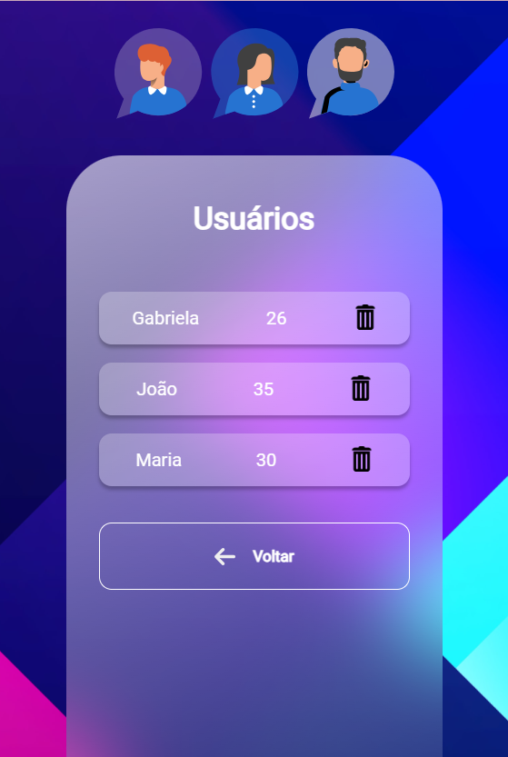

# Backend e Frontend - Tela de cadastro

Este projeto consiste em um sistema de cadastros com um backend desenvolvido em Node.js utilizando Express e um frontend em React.

## Backend (Node.js)

O backend do sistema gerencia os cadastros, fornecendo endpoints para criar, visualizar, atualizar e excluir cadastros.

### Instalação

1. Certifique-se de ter o Node.js instalado em sua máquina.
2. Clone este repositório.
3. Navegue até a pasta `first-project-node`.
4. Execute o comando `npm install` para instalar as dependências.
5. Execute o comando `node index.js` para iniciar o servidor.

### Endpoints

- `GET /order`: Retorna todos os dados cadastrados.
- `GET /order/:id`: Retorna um cadastro específico com o ID fornecido.
- `POST /order`: Cria um novo cadastro.
- `PUT /order/:id`: Atualiza um cadastro existente com o ID fornecido.
- `DELETE /order/:id`: Exclui um cadastro existente com o ID fornecido.
- `PATCH /order/:id`: Atualiza o status de um cadastro existente com o ID fornecido.

### Tecnologias Utilizadas

- Node.js
- Express
- UUID
- Cors

## Frontend (React)

O frontend do sistema permite adicionar novos pedidos e visualizar os pedidos existentes.

### Instalação

1. Certifique-se de ter o Node.js e o npm instalados em sua máquina.
2. Clone este repositório.
3. Navegue até a pasta `first-project-react`.
4. Execute o comando `npm install` para instalar as dependências.
5. Execute o comando `npm start` para iniciar o servidor de desenvolvimento.

### Funcionalidades

- Adicionar novos usuarios com nome do cliente e idade.
- Visualizar todos os dados cadastrados.
- Excluir cadastros existentes.

### Tecnologias Utilizadas

- React
- React Router DOM
- Axios

### Demontração 

